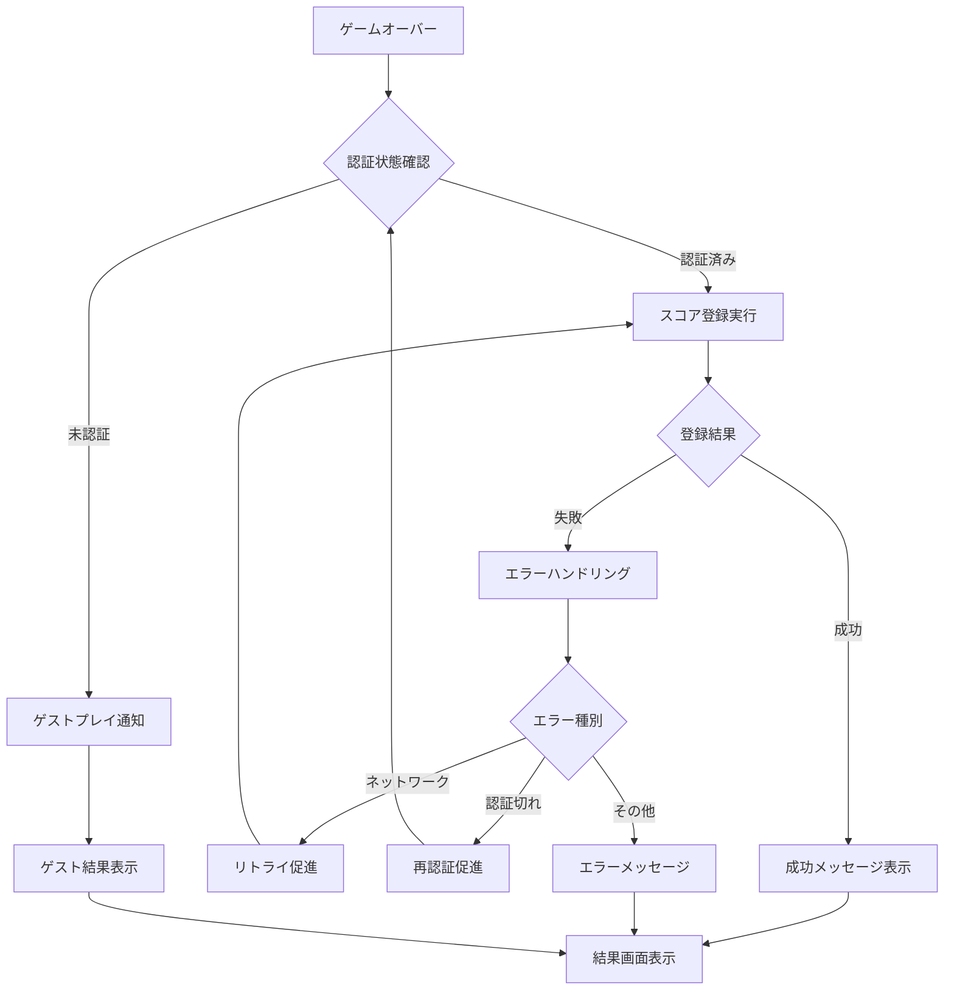

# Phase 3: ゲーム統合 実装計画

## 概要

Phase 3では、既に実装済みの認証システム（Phase 1, 2）とゲーム機能を統合し、シームレスなユーザー体験を提供します。

## 実装対象

### 3.1 認証フロー統合
- ゲーム開始前の認証チェック
- 未認証時の登録・ログイン画面表示  
- 認証成功後のゲーム開始

### 3.2 スコア登録機能
- ゲームオーバー時の自動スコア登録
- スコア登録失敗時のハンドリング

## 詳細実装仕様

### 3.1.1 アプリケーション構造の変更

#### 現在の構造
```
App.tsx
├── HighestScoreProvider
├── AnimationSpeedProvider
└── GameApp (ゲーム全体)
```

#### 変更後の構造
```
App.tsx
├── AuthProvider (認証状態管理)
├── HighestScoreProvider
├── AnimationSpeedProvider
└── MainContent
    ├── AuthGuard (認証チェック)
    └── GameApp (認証済みユーザーのみ)
```

### 3.1.2 認証チェックフロー

#### 初回アクセス時
1. `AuthProvider`でページロード時に認証状態を確認
2. 未認証の場合は`SignIn`コンポーネントを表示
3. 認証済みの場合は`GameApp`を表示

#### 認証状態の管理
- `AuthContext`を使用してアプリ全体で認証状態を共有
- 認証状態は`localStorage`に保存して永続化
- セッション有効期限の管理

### 3.1.3 UI/UXフロー設計

#### 未認証ユーザー向け画面
```
┌─────────────────────────────────────┐
│             パズルゲーム              │
├─────────────────────────────────────┤
│ スコアを記録するには認証が必要です    │
│                                     │
│ [パスキーでサインイン]               │
│ [新規登録]                          │
│                                     │
│ ※ゲストプレイも可能ですが、          │
│   スコアは保存されません             │
│                                     │
│ [ゲストでプレイ]                    │
└─────────────────────────────────────┘
```

#### 認証済みユーザー向け画面
```
┌─────────────────────────────────────┐
│ ようこそ、{username}さん！           │
│ 最高スコア: {highScore}              │
│                                     │
│ [ゲーム開始]                        │
│ [ランキング]                        │
│ [プロフィール]                      │
│ [ログアウト]                        │
└─────────────────────────────────────┘
```

### 3.2.1 スコア登録の統合

#### GameOverModalの拡張
現在の`GameOverModal`にスコア登録機能を統合済みですが、以下の改善を実施：

1. **認証状態の再確認**
   - ゲームオーバー時に認証が有効かチェック
   - セッション切れの場合は再認証を促す

2. **スコア登録の自動実行**
   - 認証済みユーザーの場合、自動でスコア登録
   - 登録成功/失敗の視覚的フィードバック

3. **エラーハンドリング**
   - ネットワークエラー時のリトライ機能
   - 詳細なエラーメッセージの表示

#### スコア登録フロー


### 3.2.2 ゲストプレイ機能

認証を強制せず、ゲストプレイも可能にする：

#### ゲストプレイの制限
- スコア登録不可
- ランキング閲覧不可
- ローカルスコアのみ保存

#### 実装方針
- `AuthGuard`でゲストプレイモードを提供
- ゲーム機能は認証状態に関係なく利用可能
- スコア関連機能のみ認証状態で制御

## 実装手順

### Step 1: AuthGuardコンポーネントの実装
```typescript
// src/components/AuthGuard.tsx
interface AuthGuardProps {
  children: React.ReactNode;
  allowGuest?: boolean;
}

export function AuthGuard({ children, allowGuest = false }: AuthGuardProps) {
  // 認証状態チェック
  // ゲストプレイ許可の制御
  // 適切なコンポーネントをレンダリング
}
```

### Step 2: App.tsxの構造変更
```typescript
// src/App.tsx
function App() {
  return (
    <AuthProvider>
      <HighestScoreProvider>
        <AnimationSpeedProvider>
          <div className="App">
            <AuthGuard allowGuest={true}>
              <GameApp />
            </AuthGuard>
          </div>
        </AnimationSpeedProvider>
      </HighestScoreProvider>
    </AuthProvider>
  );
}
```

### Step 3: GameOverModalの拡張
- 認証状態に基づくUI表示の制御
- スコア登録の自動実行
- エラーハンドリングの実装

### Step 4: ユーザー体験の改善
- ローディング状態の表示
- エラーメッセージの改善
- 成功時のフィードバック強化

## 技術的考慮事項

### セキュリティ
- セッション有効期限の適切な管理
- XSS/CSRF対策の継続
- 認証状態の改ざん防止

### パフォーマンス
- 認証チェックの最適化
- 不要な再レンダリングの防止
- ローディング時間の最小化
- 初回起動時の認証チェック最適化
- バックグラウンドでの認証状態更新の効率化
- メモリリーク防止（複数Context使用時）

### エラーハンドリング
- ネットワークエラーの適切な処理
- ユーザーフレンドリーなエラーメッセージ
- 復旧可能なエラーでのリトライ機能
- 部分的なスコア送信失敗からの回復機能
- サーバーメンテナンス時のフォールバック
- 詳細なタイムアウト処理（認証、スコア送信）

### 状態管理の複雑性対応
- AuthContextとHighestScoreProviderの連携定義
- ゲーム中の認証切れ時の状態保持戦略
- 複数Contextの依存関係とライフサイクル管理
- Context間の競合状態回避

### データ同期とキャッシング
- ゲストプレイ後の認証時ローカルスコア統合戦略
- 認証後のローカル→サーバー同期ロジック
- スコアの重複登録防止機能
- オフライン対応（ネットワーク断時の挙動定義）

### ユーザー体験の詳細設計
- ゲーム中の認証切れ対応（プレイ状態保持）
- 認証フロー中断時の状態復帰機能
- パスキー認証失敗後のスムーズな復帰

### ログとモニタリング
- 認証エラー/失敗のログ収集機能
- パフォーマンス監視のためのメトリクス
- デバッグ用の状態表示機能（開発環境）

### アクセシビリティ
- 認証フローのキーボードナビゲーション対応
- スクリーンリーダー対応
- 視覚的フィードバックの代替手段提供

## テスト項目

### 認証フロー
- [ ] 未認証ユーザーのゲストプレイ
- [ ] 認証済みユーザーのゲームプレイ
- [ ] セッション切れ時の再認証
- [ ] 認証エラー時のハンドリング
- [ ] ゲーム中の認証切れ対応
- [ ] パスキー認証失敗後の復帰

### スコア登録
- [ ] 認証済みユーザーの自動スコア登録
- [ ] ネットワークエラー時のリトライ
- [ ] セッション切れ時の再認証促進
- [ ] ゲストユーザーのスコア非登録
- [ ] 重複スコア登録の防止
- [ ] 部分的な送信失敗からの回復

### データ同期・キャッシング
- [ ] ゲストプレイ後の認証時スコア統合
- [ ] ローカル→サーバー同期の正確性
- [ ] オフライン時の挙動
- [ ] ネットワーク復旧時の自動同期

### 状態管理
- [ ] 複数Context間の連携
- [ ] メモリリークの発生防止
- [ ] Context間の競合状態回避
- [ ] 状態の一貫性保持

### エラーハンドリング・回復
- [ ] サーバーメンテナンス時のフォールバック
- [ ] タイムアウト処理の適切性
- [ ] エラーログの収集
- [ ] ユーザーへの適切なフィードバック

### UI/UX
- [ ] 認証状態に応じた画面表示
- [ ] ローディング状態の表示
- [ ] エラーメッセージの表示
- [ ] 成功時のフィードバック
- [ ] キーボードナビゲーション
- [ ] アクセシビリティ対応

### パフォーマンス
- [ ] 初回起動時の認証チェック速度
- [ ] 不要な再レンダリングの回避
- [ ] バックグラウンド処理の効率性

## 想定作業時間

- **Step 1-2 (認証フロー統合)**: 3-4時間（状態管理複雑性対応含む）
- **Step 3 (スコア登録機能)**: 2-3時間（データ同期・エラーハンドリング強化含む）
- **Step 4 (UX改善)**: 2時間（アクセシビリティ対応含む）
- **ログ・モニタリング実装**: 1時間
- **テスト・デバッグ**: 2-3時間（拡張テスト項目対応）

**総計**: 約10-13時間（詳細考慮事項追加により約2倍）

## 次のステップ

1. AuthGuardコンポーネントの実装
2. App.tsx構造の変更
3. GameOverModalの拡張
4. 動作テストと調整
5. Phase 4への準備（ランキング表示機能）